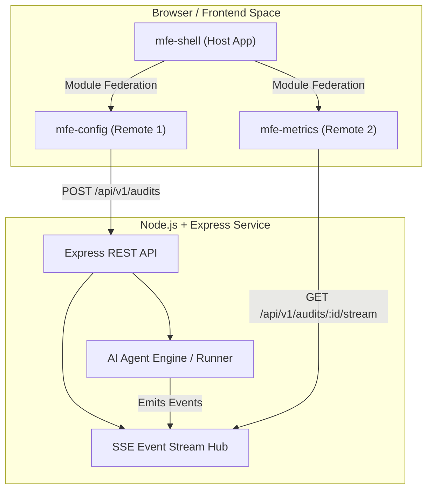
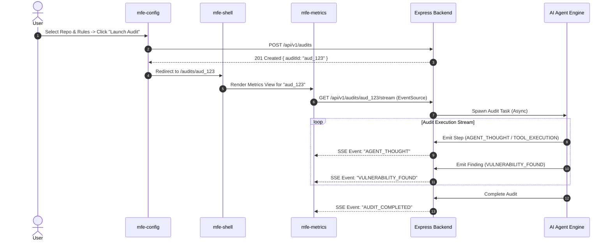

# 🏛️ System Architecture & Design Specification

This document details the architectural design for **Sentinel SDD**, specifying the Microfrontend (MFE) topology, real-time data flow, testing strategy, and backend execution engine.

---

## 1. High-Level Architecture Overview

Sentinel SDD is built as a **TypeScript Monorepo** leveraging `pnpm` Workspaces and `Turborepo`. The system decouples the user interface into independent Microfrontends and connects to a Node.js/Express backend that streams AI Agent events via Server-Sent Events (SSE).

## 2. Microfrontend (MFE) Strategy

The frontend uses Vite + @originjs/vite-plugin-federation to enable runtime Module Federation.

### Microfrontend Topology

* **`mfe-shell` (Host / Container):** Global Layout, Routing, App Shell, Global Notification State. Powered by React, React Router, TanStack Query.
* **`mfe-config` (Remote 1):** Audit Configuration Form, Rule Selection, Severity Thresholds. Powered by React, TanStack Query, React Hook Form.
* **`mfe-metrics` (Remote 2):** Live Agent Event Stream (SSE), Health Metrics Dashboard, Refactoring Drawer. Powered by React, TanStack Query, Recharts, Custom SSE Hook.

### Runtime Communication & State
* **Inter-MFE Navigation:** Controlled by `mfe-shell` routing.
* **Data Fetching & Caching:** TanStack Query (React Query) handles server-state caching and synchronization across MFE boundaries.
* **Event Streaming:** `mfe-metrics` consumes a custom React Hook (`useAgentStream`) connected to the Express SSE endpoint.

---

## 3. Real-Time Communication Flow (SSE)

Real-time feedback is achieved using Server-Sent Events (SSE), establishing a lightweight, unidirectional streaming pipe from the Node.js backend to the browser.

## 4. Backend Architecture (Node.js + Express)

The backend is a lightweight Node.js service written in TypeScript.

### Core Modules
* **`controllers/audit.controller.ts`**: Handles REST requests to trigger audits and returns audit metadata.
* **`controllers/stream.controller.ts`**: Sets HTTP headers for SSE (`Content-Type: text/event-stream`, `Cache-Control: no-cache`, `Connection: keep-alive`) and pipes events from the Agent Engine.
* **`agent/runner.ts`**: Manages execution flow, reading local code files or invoking CLI/LLM tools, emitting formatted event objects conforming to `specs/events-schema.json`.

---

## 5. Comprehensive Testing Strategy (Testing Trophy)

Quality assurance follows a strict pyramid/trophy approach, ensuring code resilience at every layer:

1. **Mock Service Worker (MSW):** Used extensively during local development and frontend integration testing. Mocks REST endpoints and SSE streams based on the OpenAPI specification in `/specs`.
2. **Unit & Integration Testing (Vitest + React Testing Library):** Target Coverage >80% on critical domain hooks, utilities, and components.
3. **End-to-End Testing (Playwright):** Launches the full Monorepo environment (`mfe-shell` + `mfe-config` + `mfe-metrics` + `express-backend`). Validates user workflows: configuring an audit in Remote 1, redirecting via Host, and verifying real-time log rendering in Remote 2.