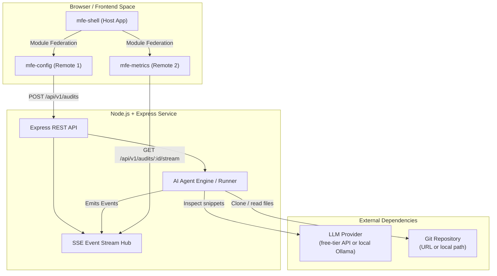
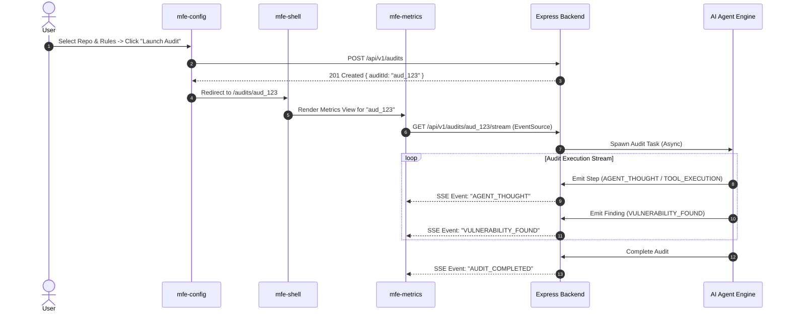

# 6. Software Architecture

> Sources: `docs/ARCHITECTURE.md` (topology, SSE flow, backend modules), PB §3/§4, user-confirmed decisions (2026-09-22).

## 6.1 Physical/Component Block Context (PBC)

**Role and scope of components:**

| Component | Role | Boundary |
|---|---|---|
| `mfe-shell` | Host: global layout, routing, app shell, global notification state; mounts remotes at runtime | Owns navigation; owns no domain logic |
| `mfe-config` | Remote 1: audit configuration (repo, rule sets, severity threshold); launches audits | Owns config forms; consumes REST contract |
| `mfe-metrics` | Remote 2: live SSE console, health dashboard, refactoring drawer, Markdown export | Owns presentation of results; consumes SSE + export API |
| Express API | REST entry point (`/api/v1`), audit lifecycle management | Validates against `specs/openapi.yaml` |
| SSE Event Hub | Per-audit ordered event channel; decouples Agent Engine from HTTP connections | Validates events against `specs/events-schema.json` |
| Agent Engine (Runner) | Orchestrates audit: clone/read repo, inspect snippets via LLM, emit typed events | Only component allowed to call the LLM |

## 6.2 Architecture Patterns

| Pattern | Application |
|---|---|
| **Microfrontends + Module Federation** | Runtime composition: host loads remotes via `@originjs/vite-plugin-federation` (constraint C-01) |
| **Monorepo** | pnpm Workspaces + Turborepo (`apps/*`, `packages/*`) (constraint C-05) |
| **Spec-first / contract-driven** | `/specs` as source of truth for REST + SSE (constraint C-04) |
| **Unidirectional event streaming** | SSE from backend to browser; agent emits, hub fans out (constraint C-02) |
| **Layered lightweight backend** | Controllers → Agent Runner → LLM abstraction (no heavy framework) |

## 6.3 Technology Stack

### 6.3.1 PBC Role & Scope Detail

- **`mfe-shell` (Host):** React, React Router, TanStack Query. Global layout, inter-MFE navigation, global notification state.
- **`mfe-config` (Remote 1):** React, TanStack Query, React Hook Form. Audit configuration form, rule selection, severity thresholds.
- **`mfe-metrics` (Remote 2):** React, TanStack Query, Recharts, custom SSE hook (`useAgentStream`). Live console, dashboard, refactoring drawer, Markdown export.
- **Backend (`apps/api`):** Node.js ≥ 20, Express, TypeScript. Controllers, SSE hub, Agent Runner.

### 6.3.2 Technology Stack

| Layer | Technology |
|---|---|
| Frontend framework | React + Vite |
| MFE composition | `@originjs/vite-plugin-federation` (Module Federation) |
| Server state / caching | TanStack Query (shared across MFE boundaries) |
| Forms (`mfe-config`) | React Hook Form |
| Charts (`mfe-metrics`) | Recharts |
| Backend runtime | Node.js ≥ 20 + Express + TypeScript |
| Real-time channel | Server-Sent Events (native HTTP streaming) |
| LLM access | Free-tier LLM APIs and/or local Ollama, behind an internal abstraction layer |
| Monorepo tooling | pnpm Workspaces + Turborepo |
| Testing | Vitest, React Testing Library, MSW, Playwright (see `10-testing.md`) |

### 6.3.3 Data Strategy

In-memory only for the MVP: audit definitions, live event buffers, and final results held in Maps inside the Express process for the current session (user decision, resolves CONCERN-003). No external database — keeps $0 budget and 15-day scope. Details and consequences: `08-data-architecture.md`.

### 6.3.4 Code Strategy

- Monorepo layout: `apps/mfe-shell`, `apps/mfe-config`, `apps/mfe-metrics`, `apps/api`, `packages/*` (shared types, contracts client, UI kit if needed).
- Shared TypeScript types derived from `/specs` contracts; single source of truth.
- Agent Engine isolated behind the `agent/runner.ts` interface so execution flow is testable without real LLM calls (MSW/mocked providers).
- Simplified Gitflow: feature branches → `main` (see `09-devops.md`).

### 6.3.5 Integration Strategy

| Integration | Direction | Protocol | Contract | Risk handling |
|---|---|---|---|---|
| `mfe-config` → API | Outbound | REST (`POST /api/v1/audits`) | `specs/openapi.yaml` | MSW mocks for dev/tests |
| `mfe-metrics` → API | Inbound | SSE (`GET /api/v1/audits/:id/stream`) | `specs/events-schema.json` | `EventSource` auto-retry; in-order per audit |
| Agent Engine → LLM provider | Outbound | HTTP (free-tier API) or local HTTP (Ollama) | Internal abstraction layer | Graceful degradation + Ollama fallback (CONCERN-004) |
| Agent Engine → Git repo | Outbound | Git clone (URL) / filesystem (local path) | n/a | Local test repo as fallback target |

## 6.4 Real-Time Communication Flow

The 4 core SSE event types (`AGENT_THOUGHT`, `TOOL_EXECUTION`, `VULNERABILITY_FOUND`, `AUDIT_COMPLETED`) are formally defined in `specs/events-schema.json` — see `02-functional-overview.md` §2.4.
