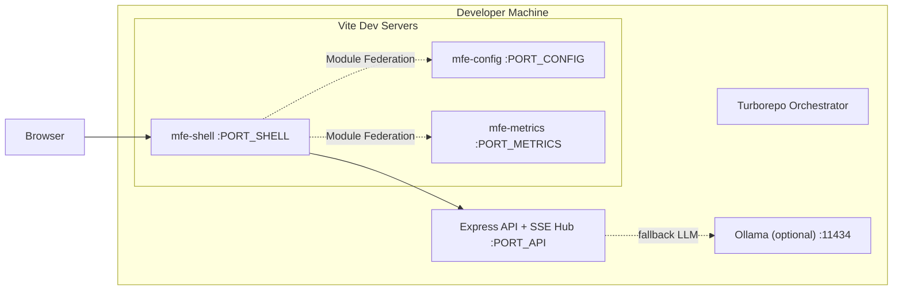

# 7. Infrastructure Architecture

> Driven by constraints C-06 ($0 budget) and C-07 (15-day PoC). No cloud infrastructure in scope.

## 7.1 Environment Model

| Environment | Type | Managed by | Purpose |
|---|---|---|---|
| Local developer machine | Dev only | Each developer | Full stack execution (`turbo dev`) |

Single environment. No UAT/Staging/Prod environments for the MVP — the deliverable is a locally-run PoC (constraint C-06/C-07; confirmed by user decision "in-memory MVP, no external DB").

## 7.2 Runtime Topology (Local)

## 7.3 Networking & Communication

- All communication over `localhost` HTTP during development.
- Vite dev server ports configured per MFE; Module Federation remotes resolved by URL at runtime.
- SSE endpoints follow standard HTTP semantics (`text/event-stream`, `no-cache`, keep-alive).
- No TLS, no reverse proxy, no CDN — out of scope for PoC.

## 7.4 Environment Dependencies

| Dependency | Required | Notes |
|---|---|---|
| Node.js ≥ 20 | Yes | Runtime for backend and all tooling |
| pnpm + Turborepo | Yes | Workspace + task orchestration |
| LLM access | One of: free-tier API key, or local Ollama | Abstraction layer switches between them (see `06-software-architecture.md` §6.3.5) |
| Git | Yes | Cloning audited repositories |
| Docker | Optional | Only if the team prefers containerized local runs; not required by the architecture |

## 7.5 Future Environments (out of MVP scope)

> **[TO BE DEFINED]** — If the PoC graduates to a shared/deployed environment: hosting target (single VM vs. container platform), TLS termination, and CI-driven deployment. Not needed for the 15-day MVP; revisit after PoC evaluation. See `09-devops.md` §9.4.
